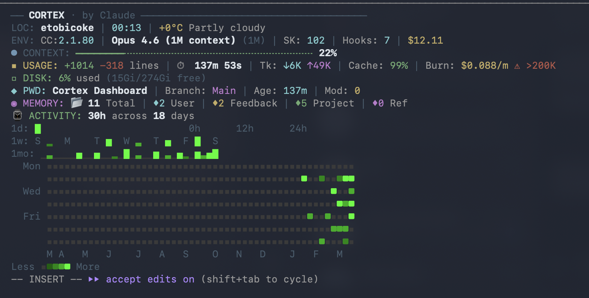

# Cortex

**A feature-rich statusline dashboard for Claude Code.**

Cortex transforms the Claude Code status bar into a full monitoring dashboard with real-time session metrics, weather, git status, memory tracking, and a GitHub-style activity heatmap.



## Features

| Section | What it shows |
|---------|--------------|
| **LOC** | Location, local time, weather (via wttr.in) |
| **ENV** | Claude Code version, model, context window size, skills/hooks count, session cost |
| **CONTEXT** | Color-coded progress bar — green < 70%, yellow 70-89%, red 90%+ |
| **PLAN** | Claude plan usage — 5-hour and 7-day rate-limit bars with reset countdown (Pro/Max plans) |
| **USAGE** | Lines changed, session duration, tokens (in/out), cache hit ratio, burn rate ($/min), >200K warning |
| **DISK** | Local disk usage with color-coded warnings |
| **PWD** | Working directory, git branch, session age, modified files, commits ahead |
| **MEMORY** | Claude memory file counts by type (user, feedback, project, reference) |
| **ACTIVITY** | GitHub-style heatmap — 24h hourly, weekly, 30-day sparkline, 52-week contribution grid |

## Quick Start

```bash
git clone https://github.com/Mysticoleslaw/cortex-dashboard.git
cd cortex-dashboard
chmod +x install.sh
./install.sh
```

Then start a new Claude Code session. Cortex appears at the bottom of your terminal.

## Compatibility

| Platform | Supported | Notes |
|----------|-----------|-------|
| Claude Code CLI | Yes | Full support — this is what Cortex is built for |
| Terminal apps (iTerm2, WezTerm, Kitty) | Yes | Any terminal running Claude Code CLI |
| SSH / Mobile (Termius, Blink) | Yes | Works over SSH as long as Claude Code CLI is running |
| VS Code extension | No | Claude Code's VS Code/Cursor extensions don't support statuslines |
| Cursor extension | No | Same limitation as VS Code |
| Codex (OpenAI) | No | Different tool entirely |

## Requirements

- [Claude Code](https://claude.ai/claude-code) CLI
- `jq` — JSON processor (`brew install jq` on macOS)
- `python3` — for the activity heatmap
- `curl` — for weather data (optional, degrades gracefully)

## How It Works

Claude Code pipes JSON session data to your statusline script on every update. Cortex reads this data and renders a multi-line dashboard with ANSI colors.

The activity heatmap maintains a lightweight usage log (`~/.claude/usage-history.tsv`) that records session duration and cost per day. This builds up over time into the 52-week contribution grid.

### Data Flow

```
Claude Code → JSON stdin → cortex.sh → dashboard output
                              ↓
                     usage-history.tsv → usage-heatmap.py → activity grid
```

### Caching

Cortex caches expensive operations to stay fast:

| Cache | TTL | What |
|-------|-----|------|
| Weather | 30 min | wttr.in API response |
| Disk | 1 min | `df` output |
| Git | 5 sec | branch, status, ahead count |
| Heatmap | 30 sec | rendered activity grid |

## Files

```
~/.claude/
├── statusline-command.sh  # Main dashboard script
├── usage-heatmap.py       # Activity heatmap renderer
├── cortex-config.json     # Section toggle config
├── commands/cortex.md     # /cortex slash command
└── usage-history.tsv      # Session history (auto-generated)
```

## Uninstall

```bash
./uninstall.sh
```

This removes the scripts and clears caches. Your usage history is preserved.

## Reading the Dashboard

Here's what every label and abbreviation means:

### LOC (Location)
| Field | Example | Meaning |
|-------|---------|---------|
| City name | `San Francisco` | Your approximate location (via IP geolocation) |
| Time | `00:18` | Local time (24h format) |
| Temp + condition | `+0°C Partly cloudy` | Current weather from [wttr.in](https://wttr.in) |

### ENV (Environment)
| Field | Example | Meaning |
|-------|---------|---------|
| CC | `2.1.80` | Claude Code CLI version |
| Model name | `Opus 4.6 (1M context)` | Active Claude model |
| (1M) / (200K) | `(1M)` | Context window size — 1M = 1 million tokens, 200K = 200,000 |
| SK | `102` | Number of skills + agents installed in `~/.claude/skills/` and `~/.claude/agents/` |
| Hooks | `7` | Number of hooks configured in `settings.json` (PreToolUse, PostToolUse, Stop) |
| $ amount | `$12.82` | Total API cost for the current session |

### CONTEXT
| Field | Example | Meaning |
|-------|---------|---------|
| Progress bar | `━━━━━╌╌╌╌╌╌╌` | Visual fill of context window used |
| Percentage | `22%` | How full the context window is — green < 70%, yellow 70-89%, red 90%+ |
| ● dot color | 🔵/🟡/🔴 | Blue = healthy, yellow = getting full, red = near limit |

### PLAN
Shows Claude plan (rate-limit) usage across all your sessions — the same data `/usage` displays. Two rows appear once the current session makes its first API call:

| Field | Example | Meaning |
|-------|---------|---------|
| `PLAN 5h` bar | `━━━━━╌╌╌╌╌╌╌ 14%` | Rolling 5-hour usage window |
| `PLAN 7d` bar | `━━━━━━━━━━╌╌╌ 41%` | Rolling 7-day usage window |
| Reset countdown | `· resets in 1h 54m` | Human-readable time until that window resets |
| ● dot color | 🔵/🟡/🔴 | Same thresholds as CONTEXT — blue < 70%, yellow 70-89%, red 90%+ |

Rows are hidden when the statusline JSON doesn't include `rate_limits` (free tier, or cold-start before the first turn).

### USAGE
| Field | Example | Meaning |
|-------|---------|---------|
| +N / -N lines | `+1027 -318` | Lines of code added/removed this session |
| ⏱ time | `142m 34s` | Total wall-clock time since session started |
| Tk ↓ | `↓6K` | Total input tokens consumed (cumulative across session) |
| Tk ↑ | `↑50K` | Total output tokens generated (cumulative across session) |
| Cache | `99%` | Prompt cache hit ratio — higher = cheaper. Green > 70%, yellow 40-70%, red < 40% |
| Burn | `$0.090/m` | Cost per minute — your current spend rate |
| ⚠ >200K | warning | Appears when last API call exceeded 200K tokens (context getting large) |

### DISK
| Field | Example | Meaning |
|-------|---------|---------|
| % used | `6%` | Local disk usage. Green < 75%, yellow 75-89%, red 90%+ |
| (used/free) | `(15Gi/274Gi free)` | Disk space used and available |

### PWD (Present Working Directory)
| Field | Example | Meaning |
|-------|---------|---------|
| Directory | `Cortex Dashboard` | Current project folder name |
| Branch | `Main` | Active git branch |
| Age | `142m` | Session duration (same as ⏱ in USAGE) |
| Mod | `0` | Number of modified/untracked files in git |
| Sync | `↑4` | Commits ahead of remote (only shown if > 0) |

### MEMORY
| Field | Example | Meaning |
|-------|---------|---------|
| 📂 Total | `11` | Total memory files across all projects |
| ♦ User | `2` | User profile memories (role, preferences) |
| ♦ Feedback | `2` | Behavioral guidance memories (do this, don't do that) |
| ♦ Project | `5` | Project context memories (goals, decisions, status) |
| ♦ Ref | `0` | Reference pointers to external systems |

### ACTIVITY
| Row | What it shows |
|-----|---------------|
| **1d** | Today's 24 hours — each bar = 1 hour (full bar = 60 min of use) |
| **1w** | This week (Sun–Sat) — each bar = 1 day (full bar = 24h of use) |
| **1mo** | Last 30 days — compact sparkline (same 24h-per-day scale) |
| **Year grid** | 52-week GitHub-style heatmap. Rows = days of week, columns = weeks |
| **Month labels** | Single-letter month markers below the grid |
| **Legend** | `Less ▪■■■■ More` — gray = no activity, bright green = heavy use |

## Slash Commands

Cortex includes a `/cortex` command for Claude Code to manage sections on the fly.

```
/cortex              — show current config
/cortex toggle loc   — toggle weather/location
/cortex toggle usage — toggle usage metrics
/cortex off activity — disable activity heatmap
/cortex on memory    — enable memory section
/cortex minimal      — only context + pwd
/cortex full         — enable everything
/cortex reset        — reset to defaults
```

### Available Section Keys

`loc` · `env` · `context` · `plan` · `usage` · `disk` · `pwd` · `memory` · `activity`

### Activity Sub-Toggles

The activity heatmap has four independent views you can toggle:

```
/cortex toggle 1d     — today's 24-hour hourly bars
/cortex toggle 1w     — this week (Sun-Sat)
/cortex toggle 1mo    — last 30 days sparkline
/cortex toggle year   — 52-week contribution grid
```

Config is stored at `~/.claude/cortex-config.json`. Changes take effect on the next Claude Code interaction.

### Interactive Config TUI

Run `cortex-config` from your terminal for an interactive settings screen:

```bash
cortex-config
```


Navigate with arrow keys, Space to toggle, Enter to save.

The TUI has three sections:
- **Sections** — toggle main dashboard sections on/off
- **Activity Views** — independently toggle 1d, 1w, 1mo, and year heatmap views
- **Presets** — quick configs: full, minimal (context + pwd), compact (context + usage + pwd)

## Customization

The dashboard is just bash and python — edit the scripts to add or remove sections, change colors, or adjust thresholds.

### Color Thresholds

| Metric | Green | Yellow | Red |
|--------|-------|--------|-----|
| Context | < 70% | 70-89% | 90%+ |
| Plan (5h / 7d) | < 70% | 70-89% | 90%+ |
| Cache hit | > 70% | 40-70% | < 40% |
| Disk | < 75% | 75-89% | 90%+ |

### Heatmap Intensity

Year-grid squares (heavier use = brighter green):

| Level | Daily minutes |
|-------|--------------|
| None (gray) | 0 |
| Light green | 1-30 |
| Medium green | 31-90 |
| Bright green | 91-180 |
| Brightest | 180+ |

Daily bar heights (1w, 1mo rows) scale to a 24-hour ceiling:

| Bar glyph | Daily minutes |
|-----------|---------------|
| (empty)   | 0 |
| ▁         | 1-30 |
| ▂         | 31-180 (up to 3h) |
| ▃         | 181-360 (up to 6h) |
| ▅         | 361-720 (up to 12h) |
| ▆         | 721-1080 (up to 18h) |
| █         | 1081-1440 (up to 24h) |

## Inspired By

- [NetworkChuck's PAI Statusline](https://github.com/theNetworkChuck/ai-in-the-terminal)
- [GitHub Contribution Graph](https://docs.github.com/en/account-and-profile/setting-up-and-managing-your-github-profile/managing-contribution-settings-on-your-profile)
- [Claude Code Statusline Docs](https://code.claude.com/docs/en/statusline)

## License

MIT

---

*Built by Claude, for Claude Code users.*
