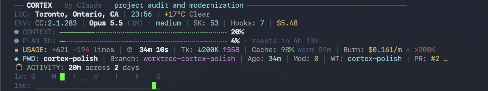

# Cortex

**A feature-rich statusline dashboard for Claude Code.**

[](https://github.com/Mysticoleslaw/cortex-dashboard/actions/workflows/test.yml)

Cortex transforms the Claude Code status bar into a full monitoring dashboard with real-time session metrics, weather, git status, memory tracking, and a GitHub-style activity heatmap.



## Features

| Section | What it shows |
|---------|--------------|
| **LOC** | Location, local time, weather (via wttr.in) |
| **ENV** | Claude Code version, model, context window size, effort level, fast mode, skills/hooks count, session cost |
| **CONTEXT** | Color-coded progress bar — green < 70%, yellow 70-89%, red 90%+ |
| **PLAN** | Claude plan usage — 5-hour and 7-day rate-limit bars with reset countdown (Pro/Max plans), plus spend limit behind a Claude apps gateway |
| **USAGE** | Lines changed, session duration, tokens in context, prompt cache hit ratio + warm/cold, burn rate ($/min), >200K warning |
| **DISK** | Local disk usage with color-coded warnings |
| **PWD** | Working directory, git branch, session age, modified files, commits ahead, worktree, open PR/MR + review state |
| **MEMORY** | Claude memory file counts by frontmatter type (user, feedback, project, reference) |
| **ACTIVITY** | GitHub-style heatmap — 24h hourly, weekly, 30-day sparkline, 52-week contribution grid |

## Quick Start

```bash
curl -fsSL https://raw.githubusercontent.com/Mysticoleslaw/cortex-dashboard/Main/get.sh | bash
```

Then start a new Claude Code session. Cortex appears at the bottom of your terminal.

This installs the latest release into `~/.cortex-dashboard` and runs `install.sh`. Want to read it before running it? It's short: [`get.sh`](get.sh).

| Option | Default | What it does |
|--------|---------|--------------|
| `CORTEX_REF` | latest release | Version, branch, or tag to install, e.g. `CORTEX_REF=v1.3.0` |
| `CORTEX_DIR` | `~/.cortex-dashboard` | Where the source is kept |
| `CORTEX_BIN_DIR` | `/usr/local/bin` | Where the `cortex-config` shortcut goes |

Set them on `bash`, e.g. `curl -fsSL …/get.sh | CORTEX_REF=v1.3.0 bash`.

## Updating and Rolling Back

When a new release is out, the dashboard header shows `⬆ v1.4.0 available · cortex update`. Cortex asks GitHub once a day in the background; turn it off with `/cortex off updates` or `"updates": false`.

| Command | What it does |
|---------|--------------|
| `cortex update` | Install the latest release |
| `cortex rollback` | Go back to the release before the installed one |
| `cortex use v1.2.0` | Install a specific release |
| `cortex version` | Show the installed version and whether an update exists |
| `cortex versions` | List available releases |

The same commands work inside Claude Code as `/cortex update`, `/cortex rollback`, and so on. Your config, usage history, and activity log carry over between versions. Settings added in newer versions default to on, so switching back and forth is safe.

Versions older than 1.3.0 don't have the update notice. The `cortex` command itself is kept when you roll back, so `cortex update` always brings you forward again. If `cortex` isn't on your PATH, run `~/.claude/cortex-cli.sh`.

### Manual install

```bash
git clone https://github.com/Mysticoleslaw/cortex-dashboard.git
cd cortex-dashboard
./install.sh
```

## Compatibility

| Platform | Supported | Notes |
|----------|-----------|-------|
| Claude Code CLI | Yes | Full support — this is what Cortex is built for |
| Terminal apps (iTerm2, WezTerm, Kitty) | Yes | Any terminal running Claude Code CLI |
| SSH / Mobile (Termius, Blink) | Yes | Works over SSH as long as Claude Code CLI is running |
| VS Code extension | No | Claude Code's VS Code/Cursor extensions don't support statuslines |
| Cursor extension | No | Same limitation as VS Code |
| Codex (OpenAI) | No | Different tool entirely |

## Requirements

- [Claude Code](https://claude.ai/claude-code) CLI
- `jq` — JSON processor (`brew install jq` on macOS)
- `python3` — for the activity heatmap
- `curl` — for weather data (optional, degrades gracefully)

## How It Works

Claude Code pipes JSON session data to your statusline script on every update. Cortex reads this data and renders a multi-line dashboard with ANSI colors.

The installer also sets `statusLine.refreshInterval` to 30 seconds (unless you've already set one), so the clock and reset countdowns stay current while a session is idle. All JSON fields are read in a single `jq` pass, so a render takes about 0.1s.

The activity heatmap measures **active time**, not how long sessions stay open. Every render checks whether that session did work since its last render (its cost or API time moved). If it did, the current minute is appended to `~/.claude/activity-minutes.log`. As a result:

- Idle sessions and refresh ticks don't count.
- Parallel sessions share one timeline, so five background agents working the same hour count as one hour, not five.
- Gaps of up to 5 minutes between active minutes are filled in, so reading output and typing the next prompt still count.

Cortex also keeps a per-session log (`~/.claude/usage-history.tsv`) with wall-clock duration and cost. Days recorded before the activity log existed fall back to it, capped at 60 min/hour and 24h/day.

### Data Flow

```
Claude Code → JSON stdin → cortex.sh → dashboard output
                              ↓
          activity-minutes.log + usage-history.tsv → usage-heatmap.py → activity grid
```

### Caching

Cortex caches expensive operations to stay fast:

| Cache | TTL | What |
|-------|-----|------|
| Weather | 30 min | wttr.in API response |
| Disk | 1 min | `df` output |
| Git | 5 sec | branch, status, ahead count (cached per directory, so parallel sessions don't mix) |
| Heatmap | 30 sec | rendered activity grid |

## Files

```
~/.claude/
├── statusline-command.sh  # Main dashboard script
├── usage-heatmap.py       # Activity heatmap renderer
├── cortex-config.json     # Section toggle config
├── cortex-config-tui.py   # Interactive config TUI (`cortex-config`)
├── cortex-cli.sh          # `cortex` update / rollback command
├── cortex-version         # Installed version (e.g. v1.3.0)
├── commands/cortex.md     # /cortex slash command
├── activity-minutes.log   # Active minutes for the heatmap (auto-generated)
└── usage-history.tsv      # Per-session duration + cost (auto-generated)
```

Caches live in `/tmp/claude-statusline-*` (override with `CORTEX_CACHE_DIR`).

## Tests

```bash
./tests/run.sh
```

Renders the dashboard against fixture payloads in a throwaway HOME and cache directory, so it never touches your real `~/.claude`. CI runs it on Linux and macOS for every push and pull request. It covers every section, config toggles, concurrent history writes, active-minute logging, heatmap math, the update notice, and the full install → update → rollback cycle against a local stand-in repo.

## Uninstall

```bash
./uninstall.sh
```

This removes the scripts, the config TUI, the `cortex` and `/cortex` commands, the `statusLine` setting, and all caches. Your config, usage history, and activity log are preserved.

## Reading the Dashboard

Here's what every label and abbreviation means:

### LOC (Location)
| Field | Example | Meaning |
|-------|---------|---------|
| City name | `San Francisco` | Your approximate location (via IP geolocation) |
| Time | `00:18` | Local time (24h format) |
| Temp + condition | `+0°C Partly cloudy` | Current weather from [wttr.in](https://wttr.in) |

### Header
The top rule shows the session name (from `--name`, `/rename`, or the AI-generated title) when one exists.

### ENV (Environment)
| Field | Example | Meaning |
|-------|---------|---------|
| CC | `2.1.80` | Claude Code CLI version |
| Model name | `Opus 4.6 (1M context)` | Active Claude model |
| (1M) / (200K) | `(1M)` | Context window size — 1M = 1 million tokens, 200K = 200,000 |
| Effort | `xhigh` | Current reasoning effort (`low` → `max`). Hidden when the model doesn't support effort |
| ⚡fast | `⚡fast` | Shown when fast mode is on |
| SK | `53` | Number of skills (`~/.claude/skills/*/SKILL.md`) + agents (`~/.claude/agents/*.md`) installed |
| Hooks | `7` | Number of hooks configured in `settings.json` (PreToolUse, PostToolUse, Stop) |
| $ amount | `$12.82` | Total API cost for the current session |

### CONTEXT
| Field | Example | Meaning |
|-------|---------|---------|
| Progress bar | `━━━━━╌╌╌╌╌╌╌` | Visual fill of context window used |
| Percentage | `22%` | How full the context window is — green < 70%, yellow 70-89%, red 90%+ |
| ● dot color | 🔵/🟡/🔴 | Blue = healthy, yellow = getting full, red = near limit |

### PLAN
Shows Claude plan (rate-limit) usage across all your sessions — the same data `/usage` displays. Two rows appear once the current session makes its first API call:

| Field | Example | Meaning |
|-------|---------|---------|
| `PLAN 5h` bar | `━━━━━╌╌╌╌╌╌╌ 14%` | Rolling 5-hour usage window |
| `PLAN 7d` bar | `━━━━━━━━━━╌╌╌ 41%` | Rolling 7-day usage window |
| `SPEND` bar | `━━━━━━╌╌╌╌╌╌╌ 62%` | Spend limit behind a [Claude apps gateway](https://code.claude.com/docs/en/claude-apps-gateway-spend-limits). Can exceed 100% |
| Reset countdown | `· resets in 1h 54m` | Human-readable time until that window resets |
| ● dot color | 🔵/🟡/🔴 | Same thresholds as CONTEXT — blue < 70%, yellow 70-89%, red 90%+ |

Each row is hidden when its window is missing from the statusline JSON (free tier, cold start before the first turn, or no gateway for SPEND). Each bar can be toggled independently via the TUI ("PLAN BARS" section) or by editing `plan.5h` / `plan.7d` / `plan.spend` in `~/.claude/cortex-config.json`.

### USAGE
| Field | Example | Meaning |
|-------|---------|---------|
| +N / -N lines | `+1027 -318` | Lines of code added/removed this session |
| ⏱ time | `142m 34s` | Total wall-clock time since session started |
| Tk ↓ | `↓155K` | Input tokens in the context window as of the latest API response (includes cache reads/writes) |
| Tk ↑ | `↑1K` | Output tokens from the latest API response |
| Cache | `91%` | Session-wide prompt cache hit ratio — higher = cheaper. Green > 70%, yellow 40-70%, red < 40% |
| warm / cold | `warm 42m` | Time until the cached prefix expires. Turns yellow in the last 5 minutes, so you can send the next prompt before it goes `cold` (next turn re-writes the cache) |
| Burn | `$2.140/m` | Cost per minute of Claude working (API time), so it doesn't drift down while the session sits idle. Falls back to wall-clock time if API time isn't reported |
| ⚠ >200K | warning | Last API response exceeded 200K tokens. Shown only on 200K-window models; on 1M windows the CONTEXT bar already covers it |

### DISK
| Field | Example | Meaning |
|-------|---------|---------|
| % used | `6%` | Local disk usage. Green < 75%, yellow 75-89%, red 90%+ |
| (used/free) | `(15Gi/274Gi free)` | Disk space used and available |

### PWD (Present Working Directory)
| Field | Example | Meaning |
|-------|---------|---------|
| Directory | `Cortex Dashboard` | Current project folder name |
| Branch | `Main` | Active git branch |
| Age | `142m` | Session duration (same as ⏱ in USAGE) |
| Mod | `0` | Number of modified/untracked files in git |
| Sync | `↑4` | Commits ahead of remote (only shown if > 0) |
| WT | `my-feature` | Worktree name, when inside a git worktree or a Claude Code worktree session |
| PR / MR | `#123 ✓` | Open pull request (or GitLab merge request) for the branch. ✓ approved · … pending · ✗ changes requested · ◌ draft. Cmd/Ctrl+click opens it in terminals with hyperlink support (iTerm2, Kitty, WezTerm; not Terminal.app) |

### MEMORY
| Field | Example | Meaning |
|-------|---------|---------|
| 📂 Total | `110` | Total memory files across all projects (classified by the `type:` in each file's frontmatter, falling back to a `<type>_*.md` filename prefix) |
| ♦ User | `2` | User profile memories (role, preferences) |
| ♦ Feedback | `2` | Behavioral guidance memories (do this, don't do that) |
| ♦ Project | `5` | Project context memories (goals, decisions, status) |
| ♦ Ref | `0` | Reference pointers to external systems |

### ACTIVITY
All rows measure active minutes: time when any Claude Code session was doing work (see [How It Works](#how-it-works)).

| Row | What it shows |
|-----|---------------|
| **1d** | Today's 24 hours — each bar = 1 hour (full bar = 60 min of use) |
| **1w** | This week (Sun–Sat) — each bar = 1 day (full bar = 24h of use) |
| **1mo** | Last 30 days — compact sparkline (same 24h-per-day scale) |
| **Year grid** | 52-week GitHub-style heatmap. Rows = days of week, columns = weeks |
| **Month labels** | Single-letter month markers below the grid |
| **Legend** | `Less ▪■■■■ More` — gray = no activity, bright green = heavy use |

## Slash Commands

Cortex includes a `/cortex` command for Claude Code to manage sections on the fly.

```
/cortex              — show current config
/cortex toggle loc   — toggle weather/location
/cortex toggle usage — toggle usage metrics
/cortex off activity — disable activity heatmap
/cortex on memory    — enable memory section
/cortex minimal      — only context + pwd
/cortex full         — enable everything
/cortex reset        — reset to defaults
/cortex update       — install the latest release
/cortex rollback     — go back to the previous release
```

### Available Section Keys

`loc` · `env` · `context` · `plan` · `usage` · `disk` · `pwd` · `memory` · `activity` · `updates`

### Plan Sub-Toggles

The PLAN section has three bars you can toggle independently. Edit `plan.5h` / `plan.7d` / `plan.spend` in `~/.claude/cortex-config.json` or use the interactive TUI.

| Key | What it shows |
|-----|---------------|
| `5h` | 5-hour rolling rate-limit bar |
| `7d` | 7-day rolling rate-limit bar |
| `spend` | Gateway spend-limit bar |

### Activity Sub-Toggles

The activity heatmap has four independent views you can toggle:

```
/cortex toggle 1d     — today's 24-hour hourly bars
/cortex toggle 1w     — this week (Sun-Sat)
/cortex toggle 1mo    — last 30 days sparkline
/cortex toggle year   — 52-week contribution grid
```

Config is stored at `~/.claude/cortex-config.json`. Changes take effect on the next Claude Code interaction.

### Interactive Config TUI

Run `cortex-config` from your terminal for an interactive settings screen:

```bash
cortex-config
```


Navigate with arrow keys, Space to toggle, Enter to save.

The TUI has four sections:
- **Sections** — toggle main dashboard sections on/off
- **Plan Bars** — independently toggle the 5h, 7d, and spend-limit bars
- **Activity Views** — independently toggle 1d, 1w, 1mo, and year heatmap views
- **Presets** — quick configs: full, minimal (context + pwd), compact (context + usage + pwd)

## Customization

The dashboard is just bash and python — edit the scripts to add or remove sections, change colors, or adjust thresholds.

### Color Thresholds

| Metric | Green | Yellow | Red |
|--------|-------|--------|-----|
| Context | < 70% | 70-89% | 90%+ |
| Plan (5h / 7d / spend) | < 70% | 70-89% | 90%+ |
| Cache hit | > 70% | 40-70% | < 40% |
| Disk | < 75% | 75-89% | 90%+ |

### Heatmap Intensity

Year-grid squares (heavier use = brighter green):

| Level | Daily minutes |
|-------|--------------|
| None (gray) | 0 |
| Light green | 1-30 |
| Medium green | 31-90 |
| Bright green | 91-180 |
| Brightest | 180+ |

Daily bar heights (1w, 1mo rows) scale to a 24-hour ceiling:

| Bar glyph | Daily minutes |
|-----------|---------------|
| (empty)   | 0 |
| ▁         | 1-30 |
| ▂         | 31-180 (up to 3h) |
| ▃         | 181-360 (up to 6h) |
| ▅         | 361-720 (up to 12h) |
| ▆         | 721-1080 (up to 18h) |
| █         | 1081-1440 (up to 24h) |

## Inspired By

- [NetworkChuck's PAI Statusline](https://github.com/theNetworkChuck/ai-in-the-terminal)
- [GitHub Contribution Graph](https://docs.github.com/en/account-and-profile/setting-up-and-managing-your-github-profile/managing-contribution-settings-on-your-profile)
- [Claude Code Statusline Docs](https://code.claude.com/docs/en/statusline)

## License

MIT

---

*Built by Claude, for Claude Code users.*
